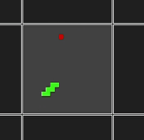
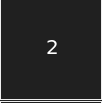
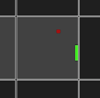

# Snake AI - Genetic Algorithm

## Auteur

- [Alexandre Jeunot-Caire](https://github.com/jeunotca)

## Visuel


## Description

Programme <b>personnel</b> développé en `Javascript` permettant de visualiser un algorithme génétique jouant au jeu "Snake".

A chaque génération, **96** snakes sont générés et cherchent à collecter le maximum de pommes, placées aléatoireement sur la map. A la fin d'une génération, les meilleurs serpents (par défaut 20% d'entre eux) sont sélectionnés et subissent des mutations, donnant naissance à une nouvelle génération. La nouvelle génération ainsi que les vainqueurs sont alors remis en jeu.

Cela permet de créer petit à petit des serpents "comprenant" les objectifs du jeu et qui s'améliorent au fil du temps.

### Informations supplémentaires

La page contient trois principales sections. A gauche se trouvent les paramètres, pour l'instant accessibles uniquement en lecture mais bientôt éditables. Au centre se trouve le coeur du programme, c'est-à-dire la visualisation des serpents apprenant à jouer. Enfin, le bas de la page contient des informations statistiques intéressantes, comme l'évolution du score moyen réalisé par les serpents, le record, ou le nombre de serpents encore en vie à chaque génération.

Remarque : pour faciliter la compréhension du jeu, un serpent particulièrement doué adoptera une couleur bleue lorsqu'il aura dépassé le record actuel.



A sa mort, le nombre de pommes mangées par le serpent sera affiché.



### Mourir de faim

Enfin, une condition a été ajoutée pour éviter les serpents qui tourneraient en rond suivant une boucle infinie. A chaque fois qu'un serpent fait un mouvement l'éloignant de la pomme, sa faim augmente. Au bout d'un certain nombre de mouvements "mauvais" sans avoir mangé une pomme pour réinitialiser sa satiété, le serpent mourra.

Visuellement, cette faim se traduit par l'opacité. Un serpent mourant sera de plus en plus transparent.



## Installation

### Récupération des sources

* Depuis l'invité de commandes (HTTP):
```bash
$ git clone https://github.com/jeunotca/snake-ai-genetic-algorithm.git
$ cd snake-ai-genetic-algorithm
```

### Dépendances

Ce programme a été réalisé à l'aide de :
- [p5.js](https://p5js.org/)
- [neataptic.js](https://wagenaartje.github.io/neataptic/)
- [frappe-chart.js](https://frappe.io/charts)


## IA

### Paramètres

L'IA, créée avec [neataptic.js](https://wagenaartje.github.io/neataptic/), prend les paramètres suivants :
- La pomme est-elle située devant le serpent ?
- La pomme est-elle située à la droite du serpent ?
- La pomme est-elle située à la gauche du serpent ?
- Y a-t-il un obstacle situé immédiatement devant le serpent ?
- Y a-t-il un obstacle situé immédiatement à la gauche du serpent ?
- Y a-t-il un obstacle situé immédiatement à la droite du serpent ?
- La distance normalisée entre le serpent et le premier obstacle situé devant lui
- La distance normalisée entre le serpent et le premier obstacle situé à sa droite
- La distance normalisée entre le serpent et le premier obstacle situé à sa gauche

L'IA renvoie un vecteur de deux valeurs contenant la décision de tourner à gauche ou à droite (si les deux valeurs sont à 0, le serpent continuera tout droit).

### Fitness function

La fonction d'évaluation est très simple, elle renvoie tout simplement le nombre de pommes mangées par le serpent.

## Utilisation

### Exécution du projet

Il suffit d'ouvrir `index.html` dans votre navigateur favori !

### Live demo

Vous pouvez trouver une démonstration de ce programme sur mon site : https://jeunot-caire.fr/projects/snake-genetic-algorithm/

## Remerciements

- [zonetti](https://github.com/zonetti/snake-neural-network) a réalisé un travail similaire qui m'a permis de réaliser **la partie graphique de ce projet**, que j'ignorais comment aborder.